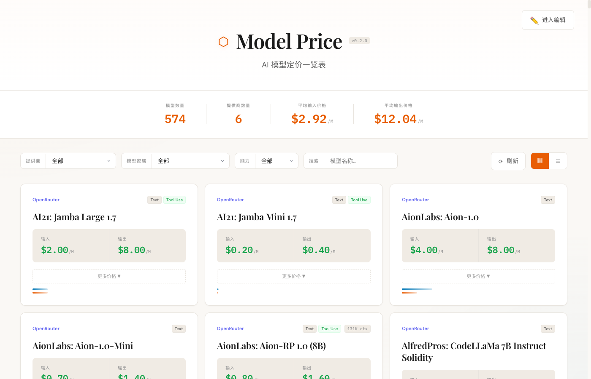
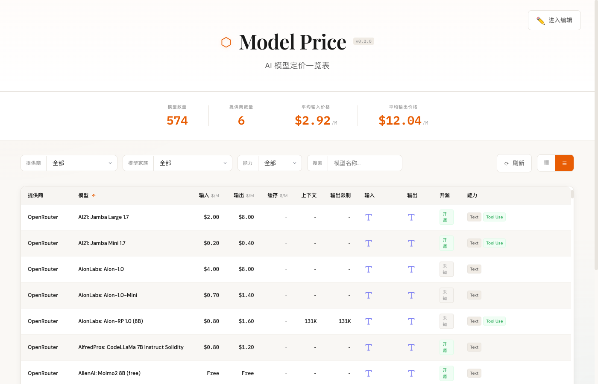
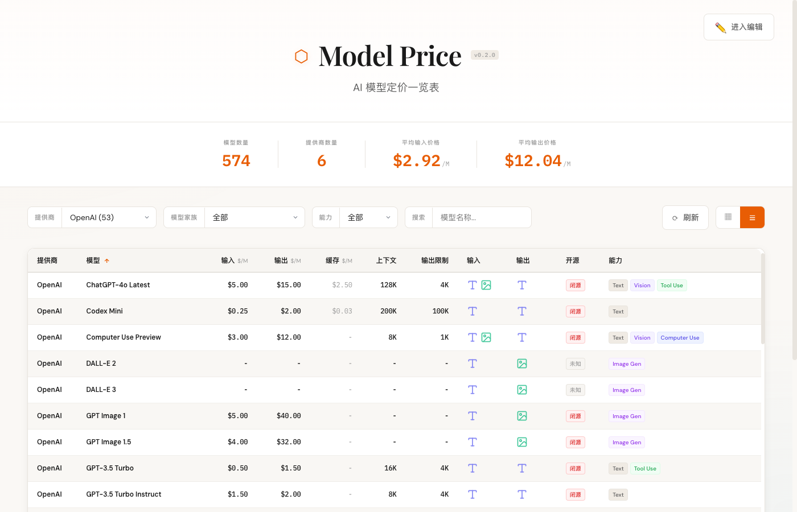

<div align="center">

# Model Price

**AI Model Pricing Aggregator** - Compare AI model pricing across major cloud providers in one place

[](https://www.python.org/)
[](https://fastapi.tiangolo.com/)
[](https://react.dev/)
[](https://www.typescriptlang.org/)
[](LICENSE)

[English](README.md) | [简体中文](README_CN.md)

</div>

---

## Features

- **Multi-provider Aggregation** - Compare pricing across 6 major AI service providers
- **Real-time Updates** - Automatic scraping of official pricing data
- **Smart Filtering** - Filter by provider, model family, and capabilities
- **Dual View Modes** - Switch between card and table views
- **Price Comparison** - Visual price bars for quick comparison
- **574+ Models** - Coverage of GPT, Claude, Gemini, Llama and more

## Screenshots

<div align="center">

#### Card View


#### Table View


#### Filter


</div>

## Supported Providers

| Provider | Models | Data Source | Update Method |
|:---------|:------:|:------------|:--------------|
| **AWS Bedrock** | 96+ | Public Pricing API | Automatic |
| **Azure OpenAI** | 50+ | Retail Pricing API | Automatic |
| **OpenAI** | 53+ | Web Scraping | Automatic |
| **Google Gemini** | 31+ | Web Scraping | Automatic |
| **OpenRouter** | 339+ | Public API | Automatic |
| **xAI (Grok)** | 12+ | Official Docs | Manual |

## Tech Stack

<table>
<tr>
<td align="center" width="50%">

**Backend**

</td>
<td align="center" width="50%">

**Frontend**

</td>
</tr>
<tr>
<td>

- Python 3.11+
- FastAPI
- Playwright (web scraping)
- httpx (async HTTP)
- uv (package manager)

</td>
<td>

- React 18
- TypeScript 5
- Vite
- CSS Variables (theming)

</td>
</tr>
</table>

## Quick Start

### Option 1: Local Development

```bash
# 1. Clone the repository
git clone https://github.com/xiaobox/model-price.git
cd model-price

# 2. Start backend
cd backend
uv run main.py
# API runs at http://localhost:8000

# 3. Start frontend (new terminal)
cd frontend
npm install
npm run dev
# Frontend runs at http://localhost:5173
```

### Option 2: Docker Deployment

```bash
# Coming soon
docker-compose up -d
```

## API Documentation

After starting the backend, visit http://localhost:8000/docs for full Swagger API documentation.

### Core Endpoints

| Method | Path | Description |
|:-------|:-----|:------------|
| `GET` | `/api/models` | Get all models (supports filtering and sorting) |
| `GET` | `/api/models/{id}` | Get single model details |
| `GET` | `/api/providers` | Get provider list |
| `GET` | `/api/families` | Get model family list |
| `GET` | `/api/stats` | Get statistics |
| `POST` | `/api/refresh` | Refresh pricing data |

## Project Structure

```
model-price/
├── backend/
│   ├── main.py              # FastAPI entry point
│   ├── config.py            # Configuration
│   ├── models/              # Data models
│   ├── providers/           # Provider data fetchers
│   │   ├── aws_bedrock.py
│   │   ├── azure_openai.py
│   │   ├── openai.py
│   │   ├── google_gemini.py
│   │   ├── openrouter.py
│   │   └── xai.py
│   ├── services/            # Business logic
│   └── data/                # Cached data
├── frontend/
│   ├── src/
│   │   ├── components/      # React components
│   │   ├── hooks/           # Custom Hooks
│   │   ├── config/          # Frontend config
│   │   └── types/           # TypeScript types
│   └── package.json
└── docs/
    └── images/              # Documentation images
```

## Data Update Strategy

| Provider | Technology | Authentication | Reliability |
|:---------|:-----------|:---------------|:-----------:|
| AWS Bedrock | httpx async | Not required | High |
| Azure OpenAI | httpx + pagination | Not required | High |
| OpenAI | Playwright scraper | Not required | Medium |
| Google Gemini | Playwright scraper | Not required | Medium |
| OpenRouter | httpx API | Not required | High |
| xAI | Static data | N/A | Manual update |

## Development Guide

### Backend Development

```bash
cd backend

# Add dependencies
uv add <package-name>

# Run dev server (hot reload)
uv run main.py

# Manually refresh data
curl -X POST http://localhost:8000/api/refresh
```

### Frontend Development

```bash
cd frontend

# Install dependencies
npm install

# Development mode
npm run dev

# Production build
npm run build
```

## Contributing

Contributions are welcome! Feel free to submit Issues and Pull Requests.

1. Fork this repository
2. Create your feature branch (`git checkout -b feature/amazing-feature`)
3. Commit your changes (`git commit -m 'Add amazing feature'`)
4. Push to the branch (`git push origin feature/amazing-feature`)
5. Open a Pull Request

## License

This project is licensed under the [MIT License](LICENSE).

---

If you find this project helpful, please give it a Star ⭐️! Issues and PRs are always welcome.

## Star History

[](https://www.star-history.com/#xiaobox/model-price&Date)
